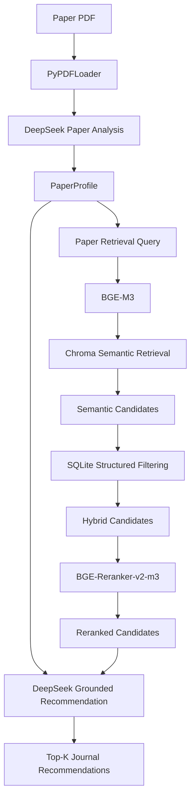
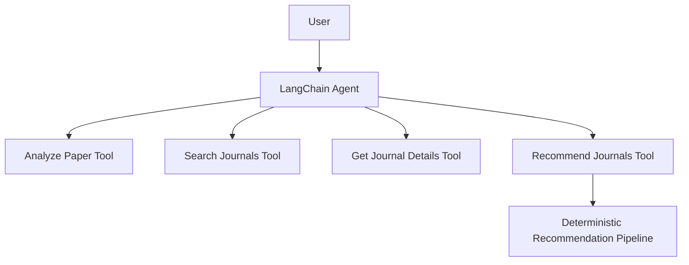

# JournalMatch-Agent

> 基于 LangChain、DeepSeek、BGE-M3、Chroma、SQLite 与 Cross-Encoder Reranker 构建的计算机领域论文期刊推荐系统。

## 1. Project Overview

JournalMatch-Agent是一个面向计算机科学论文的本地期刊推荐系统。

用户输入一篇论文 PDF 后，系统首先利用 DeepSeek 对论文进行结构化分析，提取研究方向、关键词、研究问题、方法、贡献和创新点；随后使用 BGE-M3 将论文画像与本地期刊知识库进行语义匹配，通过 Chroma 完成候选期刊召回，再结合 SQLite 中的 CCF、JCR、中科院分区及影响因子等结构化属性进行过滤。

在候选阶段后，系统使用 `BAAI/bge-reranker-v2-m3` Cross-Encoder 对候选期刊进行精排，最终由 DeepSeek 基于真实检索结果生成 Grounded Recommendation，包括推荐等级、主题契合度、方法契合度、Scope 契合度、推荐理由及潜在问题。

当前本地知识库包含约 291 本计算机领域期刊。

系统同时提供：

- Deterministic Pipeline Mode
- LangChain Agent Mode
- Offline Evaluation Framework

---

## 2. Features

### Paper Understanding

输入论文 PDF，提取结构化 `PaperProfile`：

- Title
- Abstract
- Keywords
- Research Fields
- Research Problem
- Methods
- Datasets
- Main Contributions
- Claimed Innovations
- Experimental Results
- Limitations
- Summary

### Semantic Journal Retrieval

使用：

`BAAI/bge-m3`

将论文研究画像与期刊语义信息编码为向量，通过 Chroma 完成 Semantic Retrieval。

### Structured Filtering

基于 SQLite 对候选期刊进行精确过滤：

- CCF Rank
- JCR Quartile
- CAS Quartile
- Impact Factor

支持：

- CCF A / B / C
- JCR Q1 / Q2 / Q3 / Q4
- CAS 分区
- Impact Factor 上下限

### Cross-Encoder Reranking

使用：

`BAAI/bge-reranker-v2-m3`

对 Semantic Retrieval 得到的候选期刊进行 Query-Passage Pair 级别的精细相关性排序。

### Grounded LLM Recommendation

DeepSeek 不负责凭模型记忆寻找期刊。

最终推荐仅允许从 Retrieval + Filtering + Reranking 得到的真实候选集中选择。

输出包括：

- Recommendation Tier
- Topic Fit
- Method Fit
- Scope Fit
- Reasons
- Concerns
- Paper Assessment

### Agent Tool Calling

提供基于 LangChain Agent 的自然语言交互模式。

Agent 可以根据用户意图选择：

- Analyze Paper
- Search Journals
- Get Journal Details
- Recommend Journals

Agent 只负责任务路由和 Tool Calling，不替代确定性 RAG Pipeline。

---

## 3. Architecture



Agent Mode：



---

## 4. Technology Stack

- Python 3.11
- LangChain
- DeepSeek API
- Pydantic v2
- PyPDF
- BAAI/bge-m3
- BAAI/bge-reranker-v2-m3
- Hugging Face / Sentence Transformers
- FlagEmbedding
- Chroma
- SQLite
- pandas

---

## 5. Why SQLite + Chroma?

系统将期刊数据拆分为两类。

### Semantic Data

用于 BGE Embedding：

- `name`
- `research_fields`
- `keywords`
- `aims_scope`

例如：

```text
Journal:
Information Processing & Management

Research Fields:
Information Retrieval; Natural Language Processing

Keywords:
retrieval; recommendation; NLP; artificial intelligence

Aims and Scope:
...
```

### Structured Data

由 SQLite 维护：

- `ccf_rank`
- `jcr_quartile`
- `cas_quartile`
- `impact_factor`

SQLite 是结构化期刊事实的 Source of Truth。

Chroma 只负责 Semantic Index。

因此系统采用：

**Semantic Retrieval + Structured Filtering**

而不是将所有数据都交给向量数据库处理。

---

## 6. Journal Dataset

当前核心期刊数据字段：

```text
name
ccf_rank
research_fields
keywords
aims_scope
jcr_quartile
cas_quartile
impact_factor
```

Excel 示例：

| name | ccf_rank | research_fields | keywords | aims_scope | jcr_quartile | cas_quartile | impact_factor |
|---|---|---|---|---|---|---|---|
| Journal A | A | Computer Vision; Machine Learning | segmentation; detection | ... | Q1 | 1 | 10.2 |

其中：

`research_fields` 和 `keywords` 使用 `;` 分隔多个值。

---

## 7. Project Structure

```text
journal-recommender-rag/
│
├── main.py
├── README.md
├── requirements.txt
├── .env.example
│
├── data/
│   ├── journals/
│   ├── papers/
│   └── evaluation/
│
├── storage/
│
├── reports/
│
├── src/
│   ├── config.py
│   ├── exceptions.py
│   ├── pipeline.py
│   │
│   ├── models/
│   ├── schemas/
│   ├── paper/
│   ├── journal/
│   ├── retrieval/
│   ├── recommendation/
│   ├── evaluation/
│   ├── tools/
│   └── agent/
│
├── scripts/
│   ├── init_journals.py
│   ├── build_vector_store.py
│   ├── check_environment.py
│   ├── smoke_test.py
│   └── run_agent.py
│
└── tests/
```

---

## 8. Installation

推荐使用 Conda：

```bash
conda create -n journal-rag python=3.11 -y
conda activate journal-rag
```

安装依赖：

```bash
pip install -r requirements.txt
```

---

## 9. Configuration

复制：

```bash
copy .env.example .env
```

配置示例：

```env
DEEPSEEK_API_KEY=your_deepseek_api_key
DEEPSEEK_MODEL=your_deepseek_model

BGE_MODEL_NAME=BAAI/bge-m3
RERANKER_MODEL_NAME=BAAI/bge-reranker-v2-m3

CHROMA_PERSIST_DIR=./storage/chroma_db
SQLITE_DB_PATH=./storage/journals.db
```

不要将 `.env` 上传到 GitHub。

---

## 10. Initialize Journal Database

将期刊 Excel 放入：

```text
data/journals/journals.xlsx
```

执行：

```bash
python scripts/init_journals.py data/journals/journals.xlsx
```

示例：

```text
Total rows: 291
Imported: 291
Updated: 0
Skipped: 0
Failed: 0
```

---

## 11. Build Vector Index

执行：

```bash
python scripts/build_vector_store.py
```

流程：

```text
SQLite Journals
→ LangChain Documents
→ BGE-M3 Embedding
→ Chroma
```

---

## 12. Pipeline Mode

完整推荐：

```bash
python main.py data/papers/test_paper.pdf
```

限制 CCF：

```bash
python main.py data/papers/test_paper.pdf --ccf A B
```

限制：

```text
CCF A/B
JCR Q1/Q2
IF >= 5
```

运行：

```bash
python main.py data/papers/test_paper.pdf --ccf A B --jcr Q1 Q2 --min-if 5
```

跳过最终 LLM 推荐，只查看 Reranking：

```bash
python main.py data/papers/test_paper.pdf --skip-recommendation
```

保存结果：

```bash
python main.py data/papers/test_paper.pdf --output reports/result.json
```

---

## 13. Agent Mode

启动：

```bash
python scripts/run_agent.py
```

示例：

```text
User:
Recommend journals for paper.pdf, only CCF A/B and JCR Q1/Q2.

User:
Find CCF B journals related to retrieval augmented generation.

User:
What is the JCR quartile of Information Processing & Management?

User:
Analyze paper.pdf without recommending journals.
```

Agent 会根据用户意图选择对应 Tool。

---

## 14. Retrieval Pipeline

默认两阶段检索：

```text
BGE-M3
↓
High Recall Candidate Retrieval
↓
SQLite Structured Filtering
↓
BGE-Reranker-v2-m3
↓
High Precision Reranking
```

典型设置：

```text
Hybrid Candidates: 20
Reranker Top-K:    10
Final Recommend:    5
```

---

## 15. Evaluation

项目提供 Offline Evaluation Framework，支持：

- Hit@K
- Precision@K
- Recall@K
- MRR
- nDCG@K
- Constraint Satisfaction Rate
- Candidate Containment
- Metadata Faithfulness

Gold Dataset 推荐采用：

```text
PaperProfile
+
Graded Relevant Journals
+
Optional Filters
```

Relevant Score：

```text
3 = Highly Relevant
2 = Relevant
1 = Acceptable
```

正式 Gold Dataset 仍需要人工整理，因此项目不会提前填写未经真实实验验证的 Recall、MRR 或 nDCG 指标。

Evaluation results should only be reported after running against the manually curated Gold Dataset.

---

## 16. Design Decisions

### Why BGE-M3?

期刊 Scope 与论文可能包含中英文、多领域技术词汇，因此使用多语言 Embedding 模型构建统一 Semantic Retrieval Space。

### Why Cross-Encoder Reranking?

Bi-Encoder 适合高 Recall 大规模召回，但 Query 和 Journal 是独立编码。

Cross-Encoder 可以联合处理：

```text
Paper Query + Journal Scope
```

因此适合对少量候选进行更精确的相关性排序。

### Why not let DeepSeek directly recommend journals?

LLM 可能使用训练记忆返回：

- 不存在于本地数据库的期刊
- 过时的分区
- 不准确的 Impact Factor
- 无法验证的期刊信息

因此系统采用：

```text
Retrieval determines candidates.
LLM reasons over retrieved candidates.
```

### Why keep a deterministic pipeline?

确定性 Pipeline：

- 更容易测试
- 更容易评估
- 更容易定位错误
- 更容易复现

Agent 只负责自然语言交互与高层 Tool Routing。

---

## 17. Limitations

1. 推荐范围受当前本地期刊数据库覆盖范围限制。

2. CCF、JCR、中科院分区及 Impact Factor 的准确性依赖本地数据更新时间。

3. 当前系统不预测论文录用概率。

4. 当前不将 Reranker Score 解释为投稿成功概率或录用概率。

5. 扫描版纯图片 PDF 暂不支持 OCR。

6. LLM 生成的推荐理由属于 Decision Support，不等同于真实同行评审意见。

7. Gold Evaluation Dataset 需要人工标注，目前仍在持续完善。

8. 期刊 Scope 更新后需要同步 SQLite，并在语义内容变化后重建 Chroma Index。

---

## 18. Future Work

- 扩充计算机期刊知识库
- 自动化期刊信息更新
- 更完整的 Gold Evaluation Dataset
- Failure Analysis
- Reranker Ablation Study
- Query Construction Ablation
- Web-based UI
- Containerized Deployment
- Journal Data Versioning

---

## 19. Disclaimer

This project is intended as a journal recommendation and decision-support system.

It does not guarantee paper acceptance and should not replace authors' own investigation of journal scope, submission requirements, and current official journal information.
